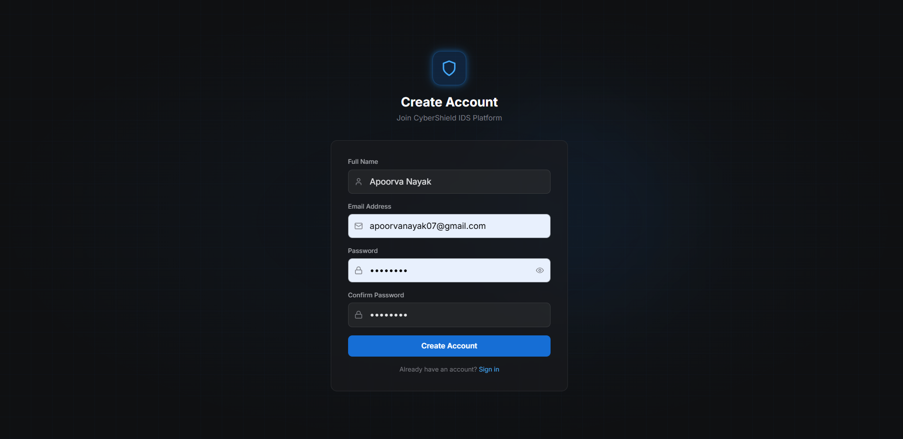
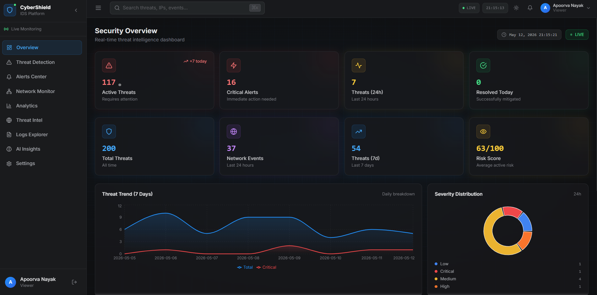

# 🛡️ CyberShield IDS — AI-Powered Intrusion Detection System

> Enterprise-grade, AI-powered Intrusion Detection System with real-time monitoring, threat intelligence, and beautiful cyber-security dashboard.

## Screenshots

### Landing page


### Dashboard



## 🚀 Quick Start

### Prerequisites
- Node.js >= 18.x
- Python >= 3.9
- MongoDB >= 6.x
- Docker & Docker Compose (optional)

### 1. Install & Run

```bash
# Backend
cd server && npm install && npm run dev

# Frontend (new terminal)
cd client && npm install && npm run dev

# ML Service (new terminal)
cd ml-service && pip install -r requirements.txt && uvicorn main:app --reload --port 5001
```

### 2. Docker Compose
```bash
docker-compose up --build
```

## 🌐 Access
| Service | URL |
|---------|-----|
| Dashboard | http://localhost:5173 |
| API | http://localhost:5000 |
| ML Service | http://localhost:5001 |

## 👤 Default Credentials
| Role | Email | Password |
|------|-------|----------|
| Admin | admin@cybershield.io | Admin@123 |
| Analyst | analyst@cybershield.io | Analyst@123 |
| Viewer | viewer@cybershield.io | Viewer@123 |
